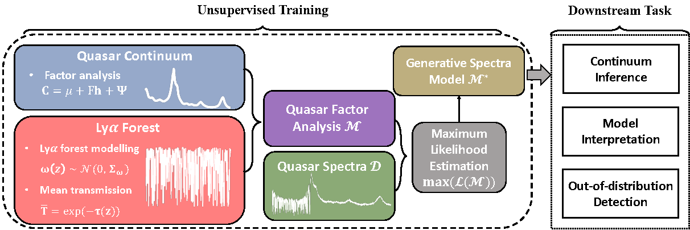

## *Quasar Factor Analysis*

**An Unsupervised and Probabilistic Quasar Continuum  Prediction Algorithm with Latent Factor Analysis**


Welcome! This is the source code for *Quasar Factor Analysis*. 😉

*Quasar Factor Analysis* (QFA) is an unsupervised and probalistic model for quasar spectrum modeling, which can be used for:

* Quasar continuum prediction 
  * High-accuracy and robust due to its unsupervsied nature
  * Reasonable uncertainty quantification
  * Flexible enough to deal with missing pixels
* Physically meaningful spectral embedding
  * One can decompose the quasar emission profile into a few components with exact physical meaning
* Out-of-distribution detection
  * Quasar spectra with interesting features can be selected via QFA thanks to its generative nature

For more details, we refer to 

* [*An Unsupervised Learning Approach for Quasar Continuum Prediction*](https://arxiv.org/abs/2207.02788)  for a brief summary
* [*Quasar Factor Analysis – An Unsupervised and Probabilistic Quasar Continuum Prediction Algorithm with Latent Factor Analysis*]()  for a detailed description

<details><summary>This document is arranged as:</summary>
<p>
* **How QFA works?**: we show the basic idea of QFA to model quasar spectra and infer quasar continuum here 🤏
  * Model assumption: we display the statistical assumptions of QFA here 🧐
  * Training: we show how to train the model here 👊
  * Continuum inference: we show how to perform continuum inference here ✌️
* **How to install this package?**: we show how to use this package here 😜
* **About this repository**: the document of this repository can be found here 🫶
</p>
</details>

### How QFA works?

QFA generatively models observed quasar spectra and applys the learned model to perform other downstream tasks.

We show the schematic plot of QFA here



#### Model assumption

QFA is build upon two assumptions:

1. Quasar continuum can be modeled as a factor model
```math
  \mathbf{C} = \mu + F\mathbf{h}+\boldsymbol{\Psi}
```

2. The Ly$\alpha$ forest can be approximated as Gaussian random fluctuations
```math
   \boldsymbol{\mathrm{\omega}}(z) \sim\mathcal{N}(0,\Sigma_\omega)
```

#### Training

#### Continuum Inference

We give an example of continuum inference with QFA here.


### How to install this package?

To install this package:

1. `git clone https://github.com/ZechangSun/QFA.git`
2. `cd ./QFA`
3. `python setup.py develop`

### About this repository

* `REAMDME.md`: that's me!
* `setup.py`: run `python setup.py develop` to install this package!
* `train.py`: python script to run large training sample.
* `QFA`: folder with all source codes.
* `nb`: jupyter notebook examples for using QFA.
* `data`: example data, including a well-trained model parameters file and a example input data file.
* `figure`: figures used for me.
* `AUTHORS.md`: author information can be found here.
* `LICENSE`: MIT License.


